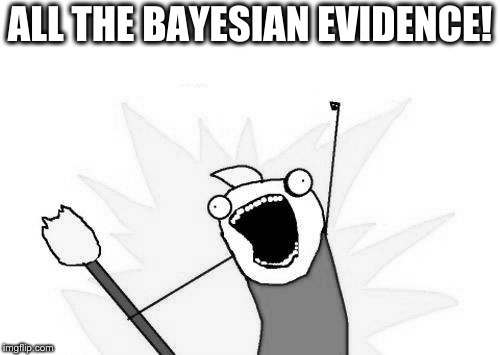

=======================================
Why allesfitter?
=======================================

.. image:: _static/images/img2.jpg
   :target: _static/images/img2.jpg

- graphical user interface, easy-to-use & all-in-one
- model multiple exoplanets, eclipsing binaries, phase curves, spots, and stellar flares [#f1]_
- various MCMC and Nested Sampling algorithms (static vs. dynamic, multinest, slicing, ...) [#f2]_
- various baseline and noise fitting options (sampling vs. hybrid, GPs, splines, polynomials, ...) [#f3]_
- click a button, get a coffee, and let *allesfitter* write your paper (it creates all latex tables and plots)

Unleash the power of Bayesian evidence and do a meaningful model comparison! 
----------------------------------------------------------------------------

- Is there evidence for an occultation? 
- Do you see phase-variations or systematic noise patterns? 
- Are those TTVs meaningful? 
- Is your orbit circular or eccentric? 
- So many questions - so much Bayesian evidence!

.. rubric:: Footnotes

.. [#f1] powered by ellc (Maxted, 2016) and aflare (Davenport et al., 2014)
.. [#f2] powered by emcee (Foreman-Mackey et al., 2013) and dynesty (Speagal, 2018)
.. [#f3] powered by celerite (Foreman-Mackey et al., 2017)

