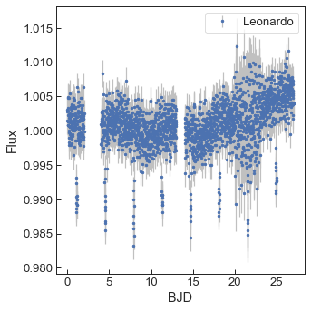

=======================================
Tutorials 03: Transits with GPs
=======================================

See on `GitHub <https://github.com/MNGuenther/allesfitter/tree/master/tutorials/03_transits_with_GPs>`_.

Imagine the star from the previous example would have been a bit more active, or your telescope would have suffered from some systematics. Then your data might have looked more like this:

You can download the data file here: :download:`Leonardo.csv <_static/tutorials/03_transits_with_GPs/Leonardo.csv>`

As an experienced allesfitter, the team asks you to model the signal. The discovery report gives you a first guess for the transit signal:

- Epoch: 1.09 +- 0.01 days after start of observations
- Period: 3.41 +- 0.01 days
- R_planet / R_star: 0.10 +- 0.01
- (R_star + R_planet) / semi-major axis: somewhere between 0.1 and 0.3
- R_star: 1.00+-0.01 R_sun
- M_star: 1.00+-0.01 M_sun
- T_eff: 5700+-100 K

Now, time to use a GP baseline! Start up the GUI *or* simply update the baseline settings and params in your template settings.csv and params.csv files from the last tutorial to make the following changes: 

settings.csv::

	baseline_flux_Leonardo,sample_GP_Matern32

params.csv::

	baseline_gp_offset_flux_Leonardo,0,1,uniform -0.01 0.01,$\mathrm{gp ln sigma (Leonardo)}$,
	baseline_gp_matern32_lnsigma_flux_Leonardo,-5,1,uniform -15 0,$\mathrm{gp ln sigma (Leonardo)}$,
	baseline_gp_matern32_lnrho_flux_Leonardo,0,1,uniform -1 15,$\mathrm{gp ln rho (Leonardo)}$,

Now run the fit. Success? Brilliant! You got great transit parameters despite all the red noise, and that allowed TMNT to schedule follow-up observations. You are now the hero of your team! They even baked you a cake! And even better: they nicely prepared all the old and new data for you in tutorial 04_transits_and_rvs:

* Leonardo.csv (discovery photometry)
* Michelangelo.csv (follow-up photometry)
* Donatello.csv (decent RV data)  
* Raphael.csv (good RV data)

Now let's allesfit all that data! Move on to the next tutorial and learn how to tackle all these data sets from scratch.