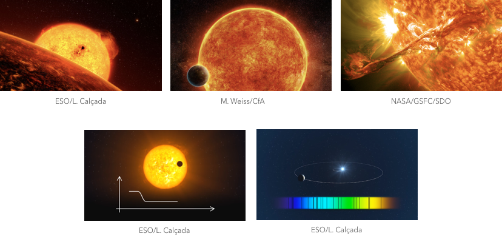

=======================================
The models
=======================================

Model multiple exoplanets, eclipsing binaries, phase curves, star spots, and stellar flares. Powered by *ellc* (Maxted, 2016) and *aflare* (Davenport et al., 2014).

